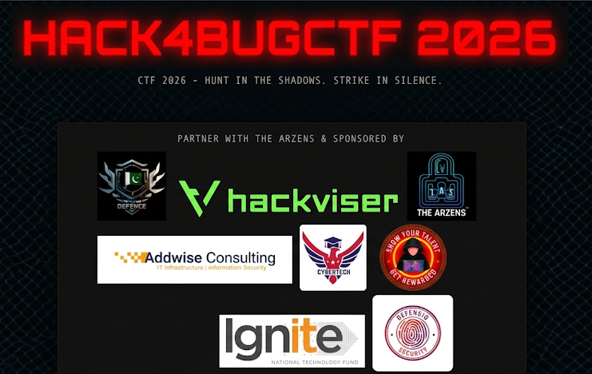
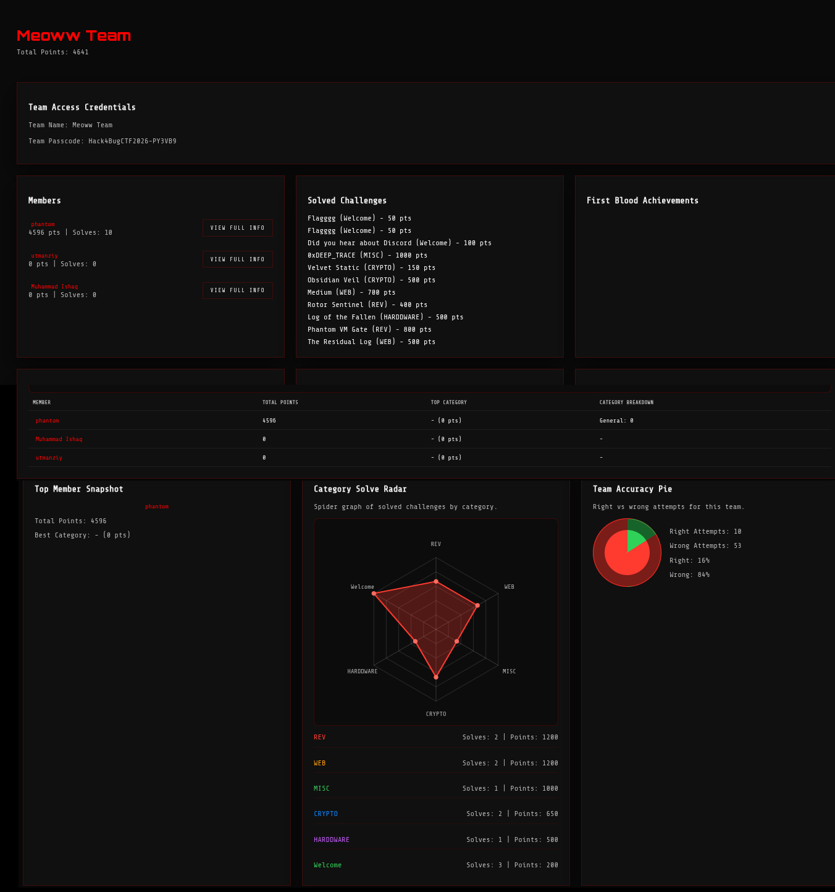
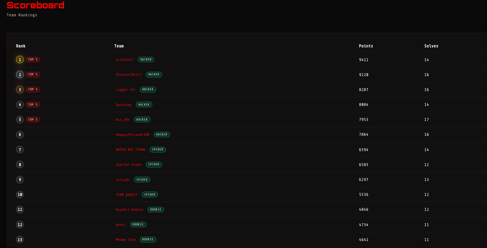
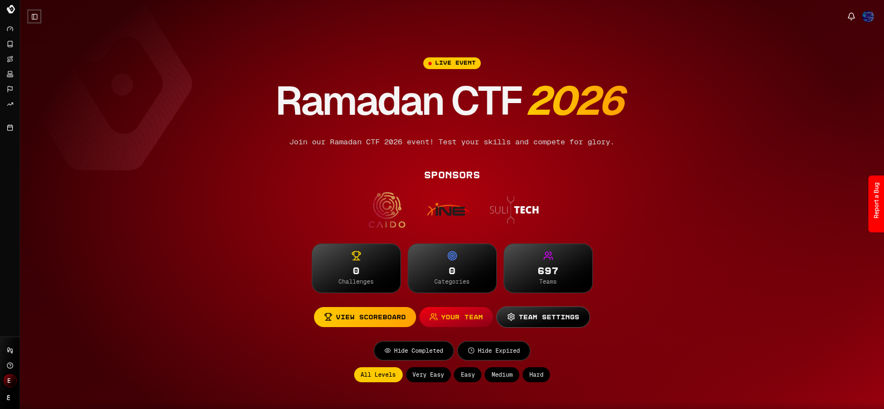
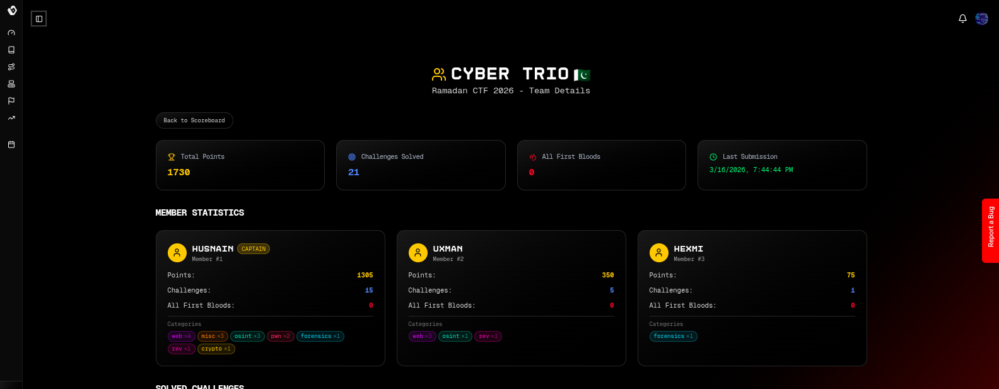
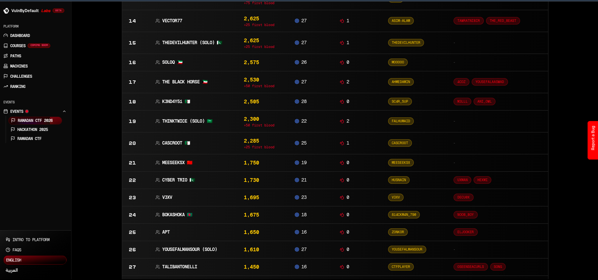
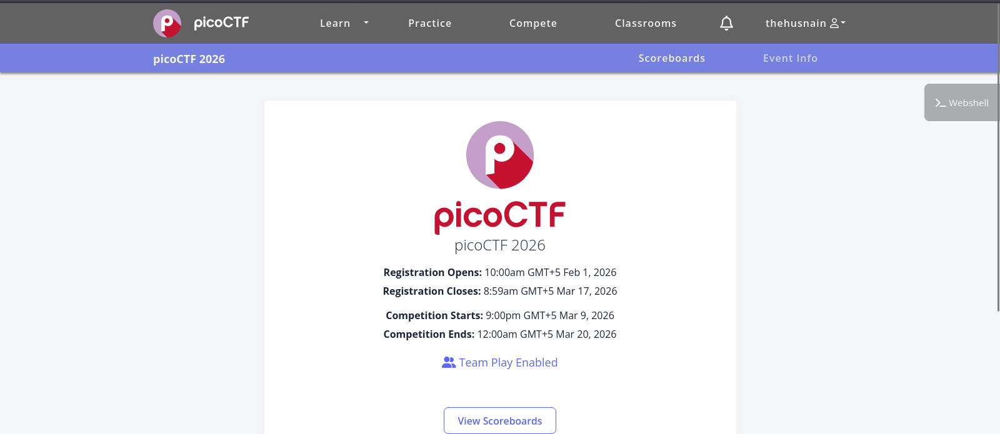
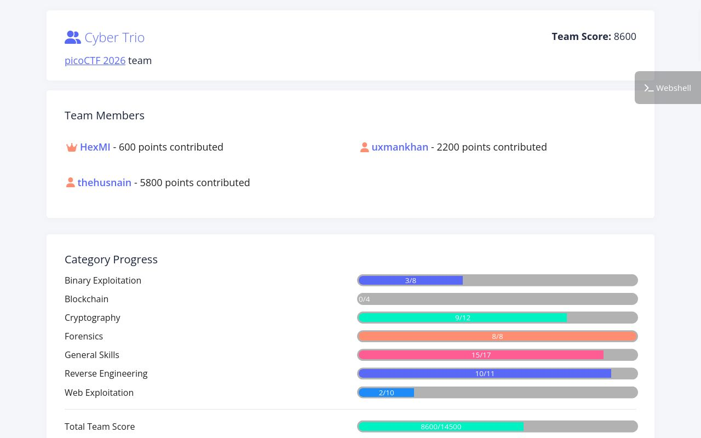
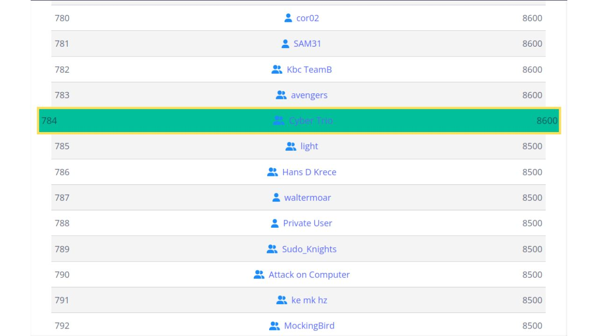

<p align="center">
  
  
  
</p>

<p align="center">
  <b>Digital footprints of our CTF grind.</b><br/>
  This repository documents the CTFs we have played so far, with team snapshots and scoreboard captures.
</p>

---

## Mission Log

```text
[FSociety::ctfs-journey]
> collect event snapshots
> track ranks and points
> preserve team progress
> prepare for next ops
```

## Journey Snapshot

| Event | Team Name | Rank (Snapshot) | Points (Snapshot) | Notes |
|---|---|---:|---:|---|
| Hack4Bug CTF 2026 | Meoww Team | 13 | 4641 | 11 solves shown in scoreboard |
| Ramadan CTF 2026 | Cyber Trio | 22 | 1730 | 21 solved challenges |
| picoCTF 2026 | Cyber Trio | 784 | 8600 | Team play enabled |

## Team Highlights (From Captured Screens)

### Hack4Bug CTF 2026
- Team profile shown as **Meoww Team** with **4641** points.
- Scoreboard snapshot shows **Rank 13**.
- Strong category spread visible across REV, WEB, MISC, CRYPTO, and HARDWARE.

<p align="center">
  
  
  
</p>

### Ramadan CTF 2026
- Team: **Cyber Trio**.
- Team stats snapshot: **1730 points**, **21 solved**, **0 first bloods**.
- Scoreboard snapshot shows **Rank 22**.
- Member contributions shown:
  - Husnain: 1305
  - Uxman: 350
  - Hexmi: 75

<p align="center">
  
  
  
</p>

### picoCTF 2026
- Team: **Cyber Trio**.
- Scoreboard snapshot shows **Rank 784** with **8600** points.
- Team contribution snapshot:
  - thehusnain: 5800
  - uxmankhan: 2200
  - HexMI: 600
- Category progress chart indicates especially strong performance in:
  - General Skills
  - Reverse Engineering
  - Forensics

<p align="center">
  
  
  
</p>

---

## Repository Structure

```text
.
|-- Hack4Bug-ctf/
|   |-- hack4bug.png
|   |-- scoreboard.png
|   `-- team.png
|-- Ramdan2026-ctf/
|   |-- ramadan-ctf.png
|   |-- scoreboard.png
|   `-- team.png
|-- picoCTF/
|   |-- picoCTF.png
|   |-- scoreboard.jpeg
|   `-- team.jpeg
`-- README.md
```

## Notes
- This repo currently stores visual progress snapshots.
- If writeups are added later, each CTF folder can include challenge-wise markdown files.
- Any credentials visible in old screenshots should be treated as historical and rotated if still active.

## FSociety Ops Signature

```text
We do not just solve challenges.
We map systems, break assumptions, and level up together.

- FSociety
```
